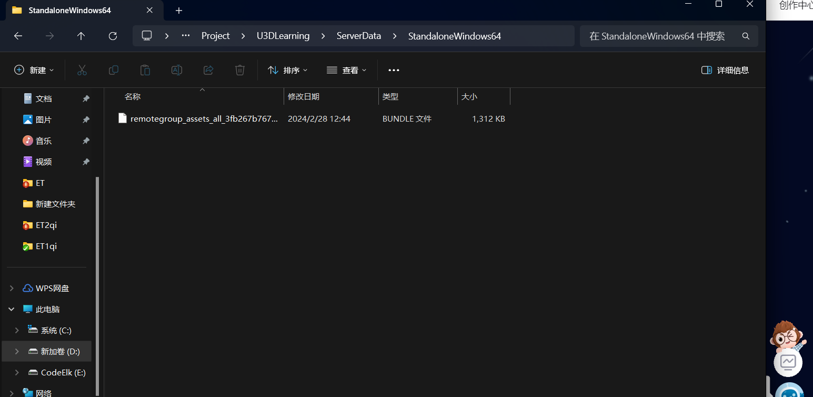
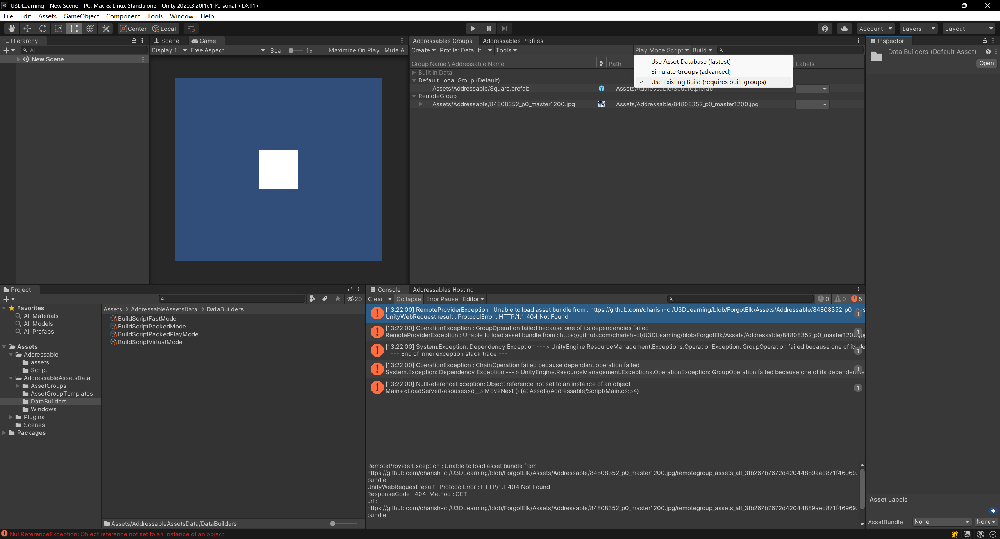
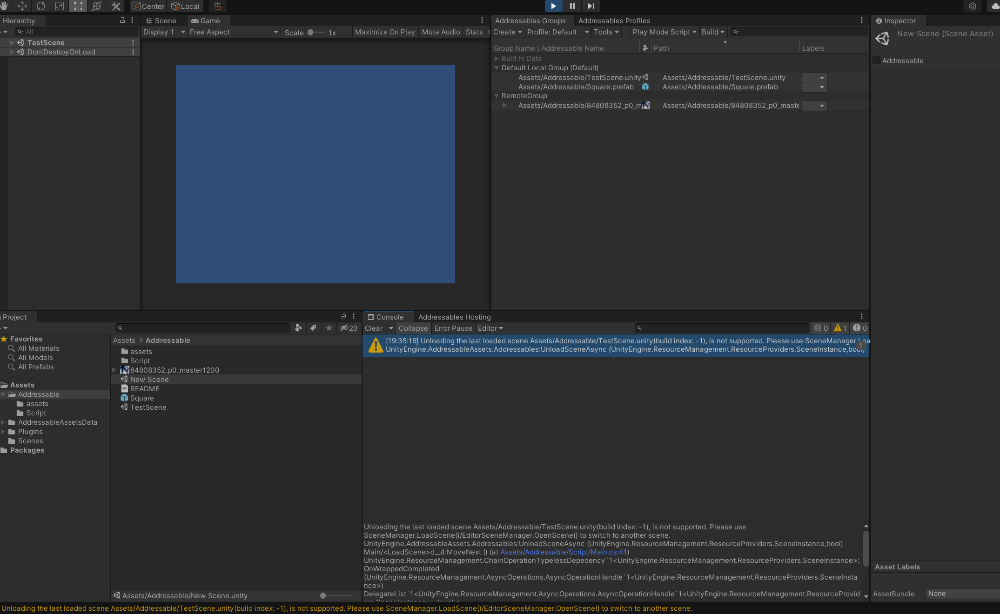

# Addressable

## 3中资源加载方式

https://blog.csdn.net/linxinfa/article/details/108894280

## Addressable参考文章

https://blog.csdn.net/linxinfa/article/details/122390621

## 官方文档

https://docs.unity3d.com/Packages/com.unity.addressables@2.0/manual/index.html

`RemoteGroup`打出来的资源就不会在包体内了，它会被打到工程目录的`ServerData/Android`目录中，

加载时也从远程加载

## 打包出来的文件

## Win11 `Hosting Services`会无法访问

注：如果你是`win11`系统，可能使用`Hosting Services`会无法访问，具体原因不明，`win11`各种恶心的问题，放弃治疗，把资源放到`https`服务器可以正常加载

## 第三种模式

## 加载场景

### 卸载场景问题

# YooAsset

## 为什么选择YooAsset

https://zhuanlan.zhihu.com/p/662209703

